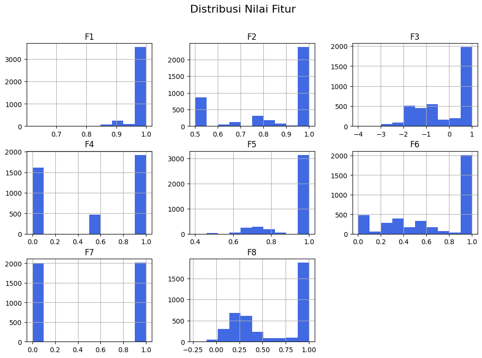
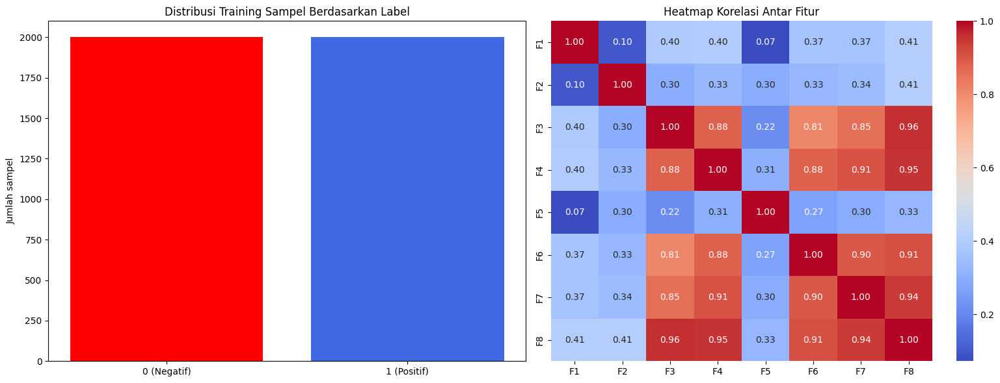
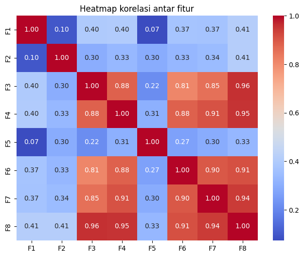
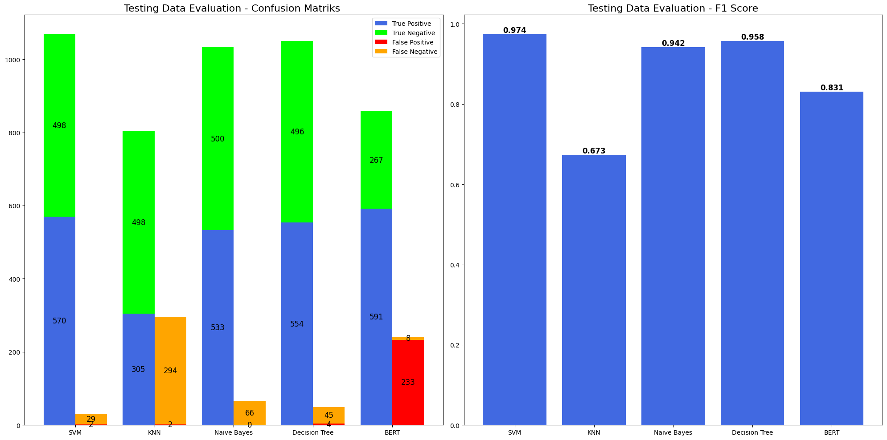

# Report Classify Candidate Pairs of Acronyms and Expansions
**Nama:** Najwan Yusnianda  
**NIM:** 2408207010029

## 1. Introduction 
Selama beberapa dekade sebelumnya, identifikasi cerdas pasangan akronim dan perluasan dari
korpus besar telah menarik perhatian penelitian yang cukup besar, terutama di bidang penambangan teks,ekstraksi entitas, dan pencarian informasi .
Salah satu penelitian oleh Taufik et al. **[1]** memperkenalkan delapan fitur vektor untuk menggambarkan pasangan akronim dan ekspansinya. Dengan fitur tersebut, Machine Learning dapat mencapai akurasi tinggi dalam klasifikasi pasangan akronim dan kepanjangannya.
Penelitian kali ini bertujuan untuk menentukan metode klasifikasi supervised learning terbaik dengan fitur-fitur tersebut serta membandingkannya dengan metode klasifikasi deep learning berbasis transformer menggunakan Bidirectional Encoder Representations from Transformers (BERT) 

## 2. Methodology  
### 2.1. Dataset  
Dataset yang digunakan dalam penelitian ini berasal dari dataacro [1] yang mempunyai 8 fitur hasi dari ekstraksi fitur pasangan akronim yang telah dikumpulak. Dataset ini terdiri dari training set (4000 sampel ) dengan testing set ( 1099 sampel). berikut adalah beberapa contoh training set:
```plaintext
BUMD=>Usaha Milik -1 1:0.91829583405449 2:1 3:-0.666666666666667 4:0 5:1 6:0.5 7:0 8:0.393089881055403
TNI=>meminjam senjata dari oknum -1 1:1 2:0.5 3:-2 4:0 5:0.75 6:0 7:0 8:0.0357142857142857
PKI=>Panitia Pengawas -1 1:0.970950594454669 2:1 3:-1 4:0.5 5:1 6:0.333333333333333 7:0 8:0.400611989684
MA=>putusan Mahkamah -1 1:1 2:0.75 3:-2 4:0 5:1 6:1 7:1 8:0.392857142857143

```

Data tersebut yang dikumpulkan selanjutnya dilakukan preprocessing untuk memisahkan antara fitur dan label dan text agar selanjutnya dapat digunakan untuk supervised learning. label yang sebelumnya terdiri dari -1 (negative class) dan 1 (positive class) diubah menjadi (0,1) agar memudahkan saat pretraining

|    |       F1 |       F2 |        F3 |   F4 |   F5 |       F6 |   F7 |        F8 |   label |
|---:|---------:|---------:|----------:|-----:|-----:|---------:|-----:|----------:|--------:|
|  0 | 0.918296 | 1        | -0.666667 |  0   | 1    | 0.5      |    0 | 0.39309   |       0 |
|  1 | 1        | 0.5      | -2        |  0   | 0.75 | 0        |    0 | 0.0357143 |       0 |
|  2 | 0.970951 | 1        | -1        |  0.5 | 1    | 0.333333 |    0 | 0.400612  |       0 |
|  3 | 1        | 0.75     | -2        |  0   | 1    | 1        |    1 | 0.392857  |       0 |
|  4 | 0.970951 | 0.666667 | -2.5      |  0   | 1    | 0        |    0 | 0.0196596 |       0 |

*Table 1: Dataset yang digunakan untuk supervised learning*

\begin{center}

|    | Fitur teks                          | Label |
|---:|:---------------------------------|------:|
|  0 | BUMD => Usaha Milik                |     0 |
|  1 | TNI => meminjam senjata dari oknum |     0 |
|  2 | PKI => Panitia Pengawas            |     0 |
|  3 | MA  => putusan Mahkamah             |     0 |
|  4 | TI  => com Mati body                |     0 |

\end{center}


*Table 2: Dataset yang digunakan untuk klasifikasi teks dengan BERT*

Rincian fitur - fitur tersebut adalah sebafai berikut:
- **Fitur 1** : Korelasi antara jumlah total karakter dalam akronim dan total
jumlah kata dalam ekspansi
- **Fitur 2** : Jumlah kata dalam ekspansi yang menggunakan huruf besar pada awal kata
- **Fitur 3** : Penimbang kecocokan huruf-huruf dalam akronim dan ekspansi/kepanjangannya, tidak termasuk kata sambung
- **Fitur 4** : Penimbang korelasi antara huruf pertama dan terakhir dari akronim.
- **Fitur 5** : Nilai Penalti kepada akronim yang mengandung banyak preposisi (kata depan) dan konjungsi (kata penghubung)
- **Fitur 6** : Rasio kecocokan yang tepat antara karakter dalam ekspansi dan karakter dalam akronim
- **Fitur 7** : Nilai Pembeda antara rasio kecocokan yang akurat (Fitur 6) dan rasio yang tidak akurat
- **Fitur 8** : rata-rata dari Fitur 1 hingga Fitur 7.

### 2.2. Data Description 
Sebelum melakukan pemodelan, penting untuk memahami karakteristik data melalui analisis statistik deskriptif.
Berikut adalah analisis deskriptif dari data (training set) yang digunakan:

|       |           F1 |          F2 |          F3 |          F4 |          F5 |          F6 |          F7 |          F8 |       label |
|:------|-------------:|------------:|------------:|------------:|------------:|------------:|------------:|------------:|------------:|
| count | 4000         | 4000        | 4000        | 4000        | 4000        | 4000        | 4000        | 4000        | 4000        |
| mean  |    0.983223  |    0.847115 |   -0.147867 |    0.538875 |    0.939538 |    0.664874 |    0.503    |    0.618394 |    0.5      |
| std   |    0.0331568 |    0.205513 |    1.21748  |    0.468088 |    0.120776 |    0.375917 |    0.500054 |    0.366575 |    0.500063 |
| min   |    0.619382  |    0.5      |   -4        |    0        |    0.4      |    0        |    0        |   -0.225958 |    0        |
| 25%   |    0.970951  |    0.666667 |   -1.28571  |    0        |    1        |    0.333333 |    0        |    0.257755 |    0        |
| 50%   |    1         |    1        |    0.333333 |    0.5      |    1        |    1        |    1        |    0.713231 |    0.5      |
| 75%   |    1         |    1        |    1        |    1        |    1        |    1        |    1        |    1        |    1        |
| max   |    1         |    1        |    1        |    1        |    1        |    1        |    1        |    1        |    1        |

  1. **Korelasi antara fitur** : Untuk mengetahui hubungan ant

 

Berdasarkan gambar tersebut ....



  


### 2.3. Model and Algorithms  
Penelitian ini menggunakan model dan algoritma supervised learning dengan menggunakan delapan fitur tersebut untuk menemukan model terbaik kemudian dibandingkan dengan model berbasis Transformer yaitu BERT (Bidirectional Encoder Representations from Transformers). Model supervised learning yang digunakan adalah sebagai berikut:  
1.  **Support Vector Machine**
2. **K-Nearest Neighbor (KNN)** 
3. **Naive Bayes** 
4. **Decision Tree**

Selanjutnya, model berbasis BERT ) digunakan sebagai pembanding. Model ini memanfaatkan arsitektur transformer untuk menangkap konteks dari kata secara lebih mendalam.


### 2.4. Experimental Setup  
Eksperimen dilakukan menggunakan Python dengan framework Scikit-Learn untuk supervised learning dan PyTorch untuk fine-tuning BERT.  
Tahapan Supervised Learning adalah sebagai berikut:
- Penyiapan Dataset: Dataset yang digunakan merupakan data akronim dan ekspansinya yang telah dilakukan ekstraksi fitur menjadi delapan fitur penting (F1 s.d F8). 
- Tuning Hyperparameter: dilakukan dengan GridSearchCV untuk menentukan hyperparameter terbaik.  
- Model dilatih dengan 4000 sampel training set dan 1099 sampel testing set.  
- Selanjutnya setiap model dilakukan evaluasi menggunakan metrik evaluasi yang sudah ditentukan.

Tahapan untuk Deep Learning berbasis transformer dengan BERT adalah sebagai berikut:
- Penyiapan Dataset: Dataset yang digunakan terdiri dari fitur 'akronim=>ekspansi' serta label yang perlu dilakukan preprocessing menggunakan tokenizer dari BERT dan menyimpannya dalam dataset custom dalam bentuk tensor agar bisa dilatih dalam pytorch
- Inisiasi model : Mengimpor model BERT (pre-trained) sebelumnya dari Hugging Face
- Menyiapkan trainer dan fine tuning : Model pretrained BERT dilatih dengan 4000 sampel training set
- Selanjutnya model dilakukan evaluasi menggunakan metrik evaluasi yang sudah ditentukan.

### 2.5. Evaluation Metrics  
 Metrik evaluasi utama yang digunakan adalah F1-Score, didukung dengan True Postive (TP), False Positive (FP), False Negative (FN) dan True Negative . Rincian Metrik yang digunakan adalah sebagai berikut:  
- **F1-score**:  
  F1-score merupakan harmonic mean antara precision dan recall. Metrik ini berguna untuk menyeimbangkan antara precision dan recall, terutama pada dataset yang tidak seimbang.  
  $$ F1 = \frac{2 \times \text{Precision} \times \text{Recall}}{\text{Precision} + \text{Recall}} $$

- **Precision**:  
  Precision mengukur ketepatan model dalam mengklasifikasikan positif, dihitung sebagai rasio antara prediksi positif yang benar dengan total prediksi positif.  
  $$ \text{Precision} = \frac{TP}{TP + FP} $$

- **Recall (Sensitivity)**:  
  Recall mengukur sejauh mana model dapat menemukan seluruh sampel positif yang sebenarnya.  
  $$ \text{Recall} = \frac{TP}{TP + FN} $$

- **True Positive (TP)**:  
  Jumlah sampel positif yang diklasifikasikan dengan benar sebagai positif.  

- **False Positive (FP)**:  
  Jumlah sampel negatif yang salah diklasifikasikan sebagai positif .  

- **False Negative (FN)**:  
  Jumlah sampel positif yang salah diklasifikasikan sebagai negatif.  

- **True Negative (TN)**:  
  Jumlah sampel negatif yang diklasifikasikan dengan benar sebagai negatif.  

## 3. Results and Discussion 
Berikut adalah hasil penelitian yang diperoleh dari eksperimen yang dilakukan menggunakan beberapa model pembelajaran mesin untuk klasifikasi data. Evaluasi dilakukan berdasarkan metrik performa dan waktu pelatihan serta prediksi.

### 3.1 Evaluasi Training Model
Tabel berikut menyajikan hasil evaluasi model berdasarkan metrik Confusion Matrix, Precision, Recall, dan F1-Score pada data pelatihan:
\begin{center}
|    | Model                        | Confusion Matrix          |   TP |   FP |   FN |   TN |   Precision |   Recall |   F1-Score |
|---:|:-----------------------------|:--------------------------|-----:|-----:|-----:|-----:|------------:|---------:|-----------:|
|  0 | Support Vector Machine (SVM) | [[1961, 39], [13, 1987]]  | 1987 |   39 |   13 | 1961 |    0.98075  |   0.9935 |   0.987084 |
|  1 | K-Nearest Neighbor (KNN)     | [[1967, 33], [1232, 768]] |  768 |   33 | 1232 | 1967 |    0.958801 |   0.384  |   0.548376 |
|  2 | Naive Bayes                  | [[1968, 32], [73, 1927]]  | 1927 |   32 |   73 | 1968 |    0.983665 |   0.9635 |   0.973478 |
|  3 | Decision Tree                | [[1961, 39], [11, 1989]]  | 1989 |   39 |   11 | 1961 |    0.980769 |   0.9945 |   0.987587 |
|  4 | BERT                         | [[1993, 7], [16, 1984]]   | 1984 |    7 |   16 | 1993 |    0.996484 |   0.992  |   0.994237 |
\end{center}

Tabel diatas menyajikan Evaluasi Training data pada model Supervised Learning dan BERT Metrik yang digunakan yaitu Confusion Matrix, Precision, Recall, dan F1-Score. Hasil evaluasi menunjukkan perbedana signifikan antar model. BERT memiliki performa model terbaik (F1-Score: 0.994), diikuti oleh Decision Tree (F1-Score: 0.988) dan SVM (F1-Score: 0.987). Sementara itu, KNN memiliki performa yang jauh lebih rendah (F1-Score: 0.548) dari model lainnya karena dengan nilai recall yang cukup rendah. False Negative (FN) pada KNN sangat tinggi, yaitu 1232, yang berarti model ini banyak sekali kesalahan mengklasifikasikan sampel positif sebagai negatif.

#### Evaluasi waktu training
Selain akurasi, efisiensi model juga dianalisis berdasarkan waktu pelatihan dan prediksi, seperti ditunjukkan pada tabel berikut:
|    | Model                    |   Training_time |   Predict_time |
|---:|:-------------------------|----------------:|---------------:|
|  0 | Support Vector Machine (SVM)                     |      9.72459    |     0.0090909  |
|  1 | K-Nearest Neighbor (kNN) |      1.27896    |     0.163998   |
|  2 | Naive Bayes              |      0.00200081 |     0.00100636 |
|  3 | Decision Tree            |      0.324775   |     0.00100446 |
|  4 | BERT                     |    286.69       |    17.757      |


### 3.2 Evaluasi Model Terbaik 
Evaluasi Model terbaik dilakukan dengan menguji data testing terhadap model yang telah dibangun dengan data training set. Hasil evaluasi ditunjukkan dalam tabel berikut:

|    | Model                        | Confusion Matrix       |   TP |   FP |   FN |   TN |   Precision |   Recall |   F1-Score |
|---:|:-----------------------------|:-----------------------|-----:|-----:|-----:|-----:|------------:|---------:|-----------:|
|  0 | Support Vector Machine (SVM) | [[498, 2], [29, 570]]  |  570 |    2 |   29 |  498 |    0.996503 | 0.951586 |   0.973527 |
|  1 | K-Nearest Neighbor (KNN)     | [[498, 2], [294, 305]] |  305 |    2 |  294 |  498 |    0.993485 | 0.509182 |   0.673289 |
|  2 | Naive Bayes                  | [[500, 0], [66, 533]]  |  533 |    0 |   66 |  500 |    1        | 0.889816 |   0.941696 |
|  3 | Decision Tree                | [[496, 4], [45, 554]]  |  554 |    4 |   45 |  496 |    0.992832 | 0.924875 |   0.957649 |
|  4 | BERT                         | [[267, 233], [8, 591]] |  591 |  233 |    8 |  267 |    0.717233 | 0.986644 |   0.830639 |


Evaluasi model yang utama digunakan adalah F1-score. Berdasarkan hasil evaluasi, Support Vector Machine (SVM) memiliki nilai F1-score tertinggi ( 0,973) diantara algoritma supervised learning serta jika dibandingkan dengan Model Transformer (BERT).  Hal ini menyatakan bahwa fitur (F1 s.d F8) sangat baik dalam mendeteksi akronim dan ekspansinya.model SVM menunjukkan stabilitas performa yang sangat baik dalam pengujian data disusul dengan Decision Tree dan Naive Bayes. Sebaliknya, model seperti K-Nearest Neighbor (KNN) dan BERT menunjukkan kelemahan signifikan pada nilai F1-score. KNN mencatatkan F1-score rendah (0,673289), sementara BERT memiliki F1-score sebesar 0,830. Meskipun KNN unggul dalam precision (0,993) dan BERT dalam recall (0,986), ketidakseimbangan antara kedua metrik tersebut menyebabkan F1-score tidak optimal.

  

Model dengan F1-score rendah memiliki pola yang berbeda pada Confussion Matriks . Pada KNN, jumlah false negative yang sangat tinggi (294) menjadi penyebab utama rendahnya recall (0,509), menunjukkan bahwa model ini gagal mengenali sebagian besar sampel positif neskipun precision mendekati sempurna. Sementara itu, BERT menunjukkan kecenderungan sebaliknya, dengan jumlah false positive yang tinggi (233), menyebabkan precision menjadi 0,717. 

## 4. Conclusion 
Berdasarkan hasil penelitian, dapat disimpulkan bahwa ...


## 5. References 
[1] Abidin TF, Mahazir A, Subianto M, Munadi K, Ferdhiana R. Recognizing Indonesian Acronym and Expansion Pairs with Supervised Learning and MapReduce. Information. 2020; 11(4):210. https://doi.org/10.3390/info11040210